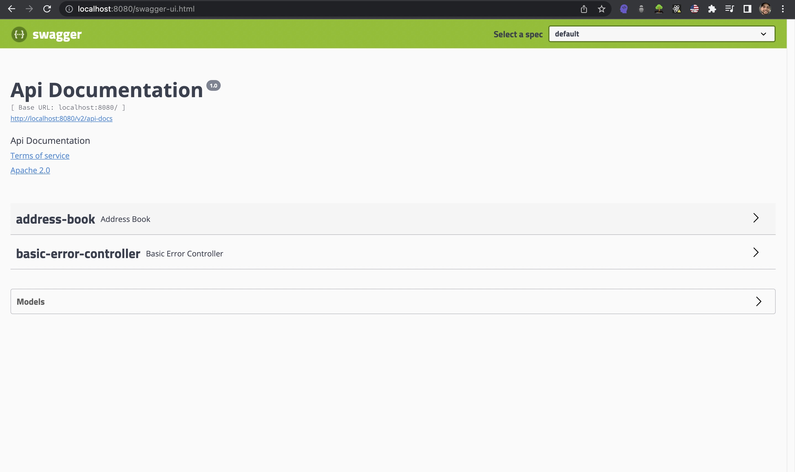
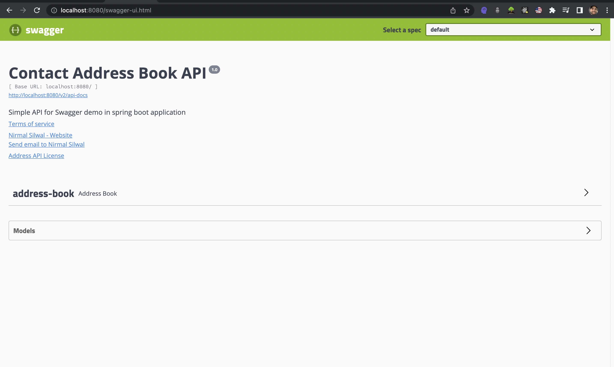

# swagger-springboot-demo
Demo project to understand how Swagger is used to create documentation of various REST endpoints of Spring Boot application

### Steps to add swagger to spring boot project
1. Getting the swagger 2 dependency
2. Enabling swagger in your code using **@EnableSwagger2** annotations
3. Configuring Swagger
4. Adding details as annotations to APIs

- add Spring fox swagger 2 dependency in pom.xml file

```
<!-- https://mvnrepository.com/artifact/io.springfox/springfox-swagger2 -->
<dependency>
    <groupId>io.springfox</groupId>
    <artifactId>springfox-swagger2</artifactId>
    <version>2.9.2</version>
</dependency>
```

#### Issues encountered in the project
 - [issue 1 - stackoverflow sloution](https://stackoverflow.com/questions/40241843/failed-to-start-bean-documentationpluginsbootstrapper-in-spring-data-rest)

### To access docs provided by Swagger
- use the endpoint `http://localhost:8080/v2/api-docs` in your Rest client like Postman

### To get html documentations use another swagger dependency called `Springfox-swagger-UI`.

```aidl
<!-- https://mvnrepository.com/artifact/io.springfox/springfox-swagger-ui -->
<dependency>
    <groupId>io.springfox</groupId>
    <artifactId>springfox-swagger-ui</artifactId>
    <version>2.9.2</version>
</dependency>
```

 - now access the endpoint `http://localhost:8080/swagger-ui.html` from your browser

### Demo of Swagger dashboard



### Customizing documentations

- The way to customize swagger is by creating an instance of  an object called **Docket**. 
Docket is an object that will contain all the customizable property that you intend the swagger to 
pick up when generating documentation. 
- The way you publish is by making **Docket as Spring Bean**.
- Docket instance is manipulated by following the **Builder Pattern.**
- When you get the Docket instance, you're going to call the **select()** method on it to get the Docket builder object.
- This is the builder object of a class called **ApiSelectorBuilder.**
- Now this builder has methods that let you customize how you want to swagger to behave. 
- You can call methods on it get everything you need and at the end you call **build()** method to get the prepared Docket object.

- You can do more customizations using **@ApiOperation** annotations on various endpoints methods in controller.
- You can also use **@ApiParam** annotation to tell more information about **@PathVariable**
- use **@ApiModel, @ApiModelProperty** annotations in models of your application to tell more about your models to the user.

### Demo after customization

